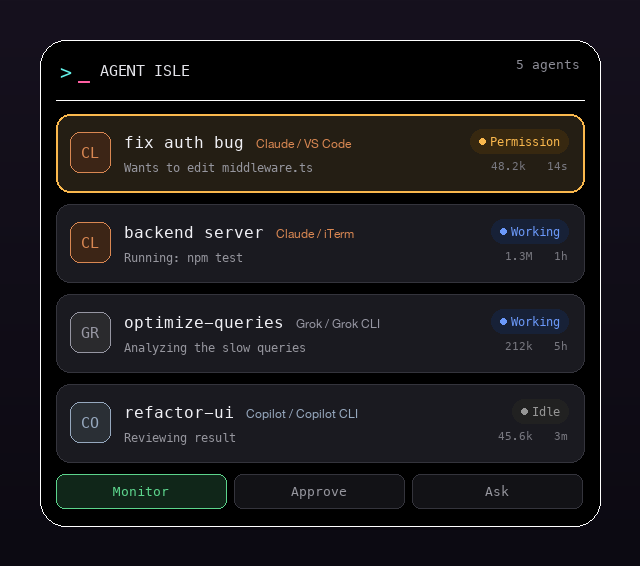

# Agent Isle

[](https://github.com/DevLab-Technologies/agent-isle/actions/workflows/build.yml)
[](https://github.com/DevLab-Technologies/agent-isle/releases/latest)
[](https://github.com/DevLab-Technologies/agent-isle/releases)
[](LICENSE)


**A Dynamic Island for your coding agents.** Agent Isle is a native macOS app that
lives in the notch and lets you monitor, approve, and jump back to your AI coding
agents — Claude Code, Grok, Copilot and more — without leaving your flow.

Pure Swift, no Electron. Runs as a lightweight menu-bar accessory under 100 MB RAM.

<p align="center">
  
</p>

> Icon: a neon terminal prompt — `>` and a block cursor.

## Features

- **Notch-anchored island** — a black pill hugging the notch that expands on hover or
  click into a full panel of every running agent session.
- **Multi-agent, hook-free monitoring** — reads each tool's own session history:
  - **Claude Code** — terminal, VS Code, Cursor, and Desktop sessions
  - **Cursor CLI** (`cursor-agent`) — read straight from its `~/.cursor/chats` store
  - **Grok CLI** and **GitHub Copilot CLI**
- **Live status** — each session shows working / idle, its latest activity line, git
  branch, elapsed time, and token usage.
- **Approve from the notch** — for Claude Code and Cursor, permission requests render an
  inline diff with Deny (⌘N) / Allow (⌘Y); the decision flows straight back to the agent.
- **Answer questions** — multiple-choice prompts answered right in the island.
- **Click to jump** — click a session to focus its terminal or IDE (detected via
  `TERM_PROGRAM`, so a session in VS Code's integrated terminal opens VS Code).
- **Filter tabs** — Monitor / Approve / Ask.
- **8-bit sound alerts** — synthesized chiptune cues, or bring your own: override any
  cue with a custom `.wav` / `.aiff` / `.mp3` in Settings → Sound.
- **Fully local** — the only moving part is a `localhost` event server; nothing leaves
  your machine.

## Install

### Homebrew

```bash
brew install --cask DevLab-Technologies/tap/agent-isle
```

Homebrew downloads the latest release, verifies it, and drops **Agent Isle.app** in
`/Applications`. Upgrade with `brew upgrade --cask agent-isle` (the in-app updater also
keeps it current).

> The cask formula lives in [`Casks/agent-isle.rb`](Casks/agent-isle.rb). Publishing it
> to the `DevLab-Technologies/homebrew-tap` repository is a pending follow-up; until that
> tap is live, use the direct download below.

### Direct download

Grab the latest prebuilt app from the [Releases page](https://github.com/DevLab-Technologies/agent-isle/releases/latest)
(see the version and total-downloads badges above). Download `Agent-Isle.zip`, unzip it,
and drag **Agent Isle.app** to `/Applications`.

If the release isn't notarized, macOS Gatekeeper blocks the first launch. Either
right-click the app and choose **Open**, or clear the quarantine flag once:

```bash
xattr -dr com.apple.quarantine "/Applications/Agent Isle.app"
```

Prefer to build from source? See [Build & run](#build--run) below.

## Requirements

- macOS 14 (Sonoma) or later, Apple Silicon or Intel
- Xcode / Swift 5.9+ toolchain (to build from source)

## Build & run

```bash
swift build                     # compile
bash Scripts/bundle.sh          # build "build/Agent Isle.app"
open "build/Agent Isle.app"     # launch (appears in the notch + menu bar)
```

On first launch it shows **demo mode** — simulated sessions so you can see it work.
It switches to real sessions automatically as soon as any are detected. Quit and
toggle demo/sound from the gear menu in the expanded island.

## Connect your agents

**Claude Code** — monitoring works with no setup (Agent Isle reads
`~/.claude/projects/` transcripts). To also approve permissions from the notch:

```bash
bash Scripts/install-hooks.sh   # adds hooks to ~/.claude/settings.json
bash Scripts/uninstall-hooks.sh # remove them (monitoring still works)
```

**Cursor CLI** (`cursor-agent`) — monitoring works with no setup (Agent Isle reads the
per-session SQLite `store.db` under `~/.cursor/chats`). To also approve shell, MCP, and
file-edit calls from the notch:

```bash
bash Scripts/install-cursor-hooks.sh   # adds hooks to ~/.cursor/hooks.json (preserves others)
bash Scripts/uninstall-cursor-hooks.sh # remove them (monitoring still works)
```

**Grok CLI / GitHub Copilot CLI** — detected automatically from `~/.grok/sessions`
and `~/.copilot/history-session-state`. Nothing to configure.

**Any other tool** — POST to the event server:

```bash
curl -X POST http://localhost:4711/event -H 'Content-Type: application/json' -d '{
  "type": "status", "session": "my-session", "agent": "codex",
  "title": "build api", "terminal": "iTerm",
  "status": "working", "message": "Writing routes/users.ts"
}'
```

### Event types

| `type`       | Behavior                                                          |
|--------------|-------------------------------------------------------------------|
| `status`     | Create/update a session (`status`, `message`, `title`).           |
| `permission` | Show an approval card; **blocks** until you decide, then replies `{"decision":"allow"\|"deny"}`. |
| `question`   | Show options; blocks until chosen, replies `{"decision":"<option>"}`. |
| `done`       | Mark the session finished.                                        |
| `remove`     | Drop the session.                                                 |

## Architecture

```
Sources/AgentIsle/
  main.swift              App entry (NSApplication, accessory policy)
  AppDelegate.swift       Notch window + menu-bar item + watcher/server wiring
  Notch/
    NotchGeometry.swift   Detects the physical notch (falls back to a centered pill)
    NotchWindow.swift     Fixed-size floating panel + click-through hit region
    PassthroughView.swift Passes clicks through everywhere except the island
  Views/
    IslandRootView.swift  Collapsed <-> expanded switch, spring animations
    CollapsedIsland.swift  Resting pill (focus session + count badge)
    ExpandedIsland.swift   Full panel: header, session list, filter tabs, gear menu
    SessionRow.swift       Per-session row (badge, status, tokens); click to jump
    PermissionCard.swift   Inline diff + Allow/Deny; QuestionCard for choices
    AppMark.swift          The terminal-prompt logo, drawn in SwiftUI
  Model/
    Models.swift          AgentKind, SessionStatus, AgentSession, PermissionRequest
    SessionStore.swift    Observable state + demo generator + filters
  Server/
    EventServer.swift     Localhost HTTP listener; parks blocking requests
    IdeWatcher.swift      Hook-free Claude Code session discovery (transcripts)
    TranscriptReader.swift Tails transcripts for activity + token totals
    ExternalAgents.swift  Adapters for Cursor / Grok / Copilot
    CursorStore.swift     Reads Cursor's SQLite store.db (meta + blob DAG)
    HookInstaller.swift   Register/remove Claude Code hooks from the app
    CursorHookInstaller.swift  Same for Cursor's ~/.cursor/hooks.json
    Jumper.swift          Focus a session's terminal/IDE
  Sound/
    SoundPlayer.swift     Runtime-synthesized square-wave alerts + custom-file playback
    SoundPack.swift       Pure event -> custom-audio-file resolution
Casks/
  agent-isle.rb           Homebrew cask (points at the GitHub release zip)
Scripts/
  bundle.sh               Package the binary into a .app
  release.sh              Universal build + (optional) notarization + zip + cask sha256
  install-hooks.sh        Register Claude Code hooks
  uninstall-hooks.sh      Remove them
  agent-isle-hook.py      Claude Code -> island bridge (approvals from the notch)
  install-cursor-hooks.sh Register Cursor hooks
  uninstall-cursor-hooks.sh Remove them
  agent-isle-cursor-hook.py Cursor -> island bridge (approvals from the notch)
  make_icon.py            Generate the app icon
```

## Contributing

Contributions are welcome — especially new agent adapters. Each adapter is a small
addition to `ExternalAgents.swift` that reads a tool's session history and returns
`ExternalSession` values. Open an issue or PR.

## License

MIT — see [LICENSE](LICENSE).
