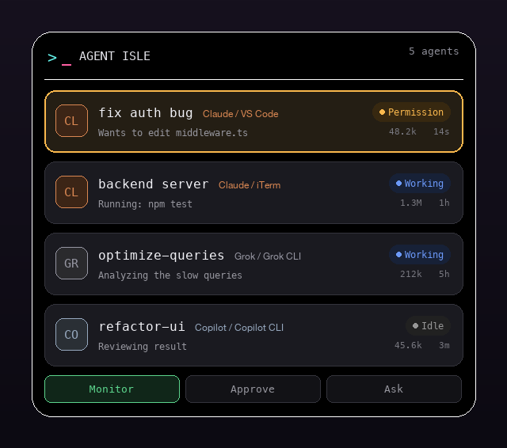

# Agent Isle

[](https://github.com/DevLab-Technologies/agent-isle/actions/workflows/build.yml)
[](https://github.com/DevLab-Technologies/agent-isle/releases/latest)
[](https://github.com/DevLab-Technologies/agent-isle/releases)
[](LICENSE)


**A Dynamic Island for your coding agents.** Agent Isle is a native macOS app that
lives in the notch and lets you monitor, approve, and jump back to your AI coding
agents — Claude Code, Grok, Copilot and more — without leaving your flow.

Pure Swift, no Electron. Runs as a lightweight menu-bar accessory under 100 MB RAM.

<p align="center">
  
</p>

> Icon: a neon terminal prompt — `>` and a block cursor.

## Features

- **Notch-anchored island** — a black pill hugging the notch that expands on hover or
  click into a full panel of every running agent session.
- **Multi-agent, hook-free monitoring** — reads each tool's own session history:
  - **Claude Code** — terminal, VS Code, Cursor, and Desktop sessions, including Desktop
    sessions running on a remote host over SSH
  - **Cursor CLI** (`cursor-agent`) — read straight from its `~/.cursor/chats` store
  - **Grok CLI** and **GitHub Copilot CLI**
- **Live status** — each session shows working / idle, its latest activity line, git
  branch, elapsed time, and token usage.
- **Approve from the notch** — for Claude Code and Cursor, permission requests render an
  inline diff with Deny (⌘N) / Allow (⌘Y); the decision flows straight back to the agent.
- **Answer questions** — multiple-choice prompts answered right in the island.
- **Click to jump** — click a session to focus the exact session, not just its host app
  (detected via `TERM_PROGRAM`): editors focus the window already open on the workspace
  (via the bundled `code`/`cursor` CLI), and Claude Desktop deep-links to the conversation.
- **Filter tabs** — Monitor / Approve / Ask.
- **8-bit sound alerts** — synthesized chiptune cues, or bring your own: override any
  cue with a custom `.wav` / `.aiff` / `.mp3` in Settings → Sound.
- **Voice callouts** — hear a spoken line when an agent finishes or needs you, with a
  distinct voice per agent. Uses the on-device system voice by default (offline, free);
  optionally bring your own OpenAI / ElevenLabs key for premium voices and your own
  OpenAI / Anthropic key for AI-written summaries. See [Voice callouts](#voice-callouts).
- **Fully local by default** — the only always-on moving part is a `localhost` event
  server; nothing leaves your machine unless *you* opt into a cloud voice/summary provider
  with your own API key.

## Install

### Homebrew

```bash
brew install --cask DevLab-Technologies/tap/agent-isle
```

Homebrew downloads the latest release, verifies it, and drops **Agent Isle.app** in
`/Applications`. Upgrade with `brew upgrade --cask agent-isle` (the in-app updater also
keeps it current).

> The cask formula lives in [`Casks/agent-isle.rb`](Casks/agent-isle.rb). Publishing it
> to the `DevLab-Technologies/homebrew-tap` repository is a pending follow-up; until that
> tap is live, use the direct download below.

### Direct download

Grab the latest prebuilt app from the [Releases page](https://github.com/DevLab-Technologies/agent-isle/releases/latest)
(see the version and total-downloads badges above). Download `Agent-Isle.zip`, unzip it,
and drag **Agent Isle.app** to `/Applications`.

If the release isn't notarized, macOS Gatekeeper blocks the first launch. Either
right-click the app and choose **Open**, or clear the quarantine flag once:

```bash
xattr -dr com.apple.quarantine "/Applications/Agent Isle.app"
```

Prefer to build from source? See [Build & run](#build--run) below.

## Requirements

- macOS 14 (Sonoma) or later, Apple Silicon or Intel
- Xcode / Swift 5.9+ toolchain (to build from source)

## Build & run

```bash
swift build                     # compile
bash Scripts/bundle.sh          # build "build/Agent Isle.app"
open "build/Agent Isle.app"     # launch (appears in the notch + menu bar)
```

On first launch it shows **demo mode** — simulated sessions so you can see it work.
It switches to real sessions automatically as soon as any are detected. Quit and
toggle demo/sound from the gear menu in the expanded island.

## Connect your agents

**Claude Code** — monitoring works with no setup (Agent Isle reads
`~/.claude/projects/` transcripts). To also approve permissions from the notch:

```bash
bash Scripts/install-hooks.sh   # adds hooks to ~/.claude/settings.json
bash Scripts/uninstall-hooks.sh # remove them (monitoring still works)
```

Claude Desktop sessions running over SSH are monitored too. They're discovered from
Desktop's own session store, and their transcript — which Claude Code writes on the remote
host — is mirrored here over SSH, incrementally, so those cards carry the same activity
line, token total, todo list, pending questions and live chat history as a local session.
Nothing to install on the remote host: it reuses the host, port and key Desktop already
connects with.

Notch **approvals** are the one thing SSH sessions don't get. Those need the hook running
on the remote host, and it posts to `localhost:4711`, which there isn't this app.

**Cursor CLI** (`cursor-agent`) — monitoring works with no setup (Agent Isle reads the
per-session SQLite `store.db` under `~/.cursor/chats`). To also approve shell, MCP, and
file-edit calls from the notch:

```bash
bash Scripts/install-cursor-hooks.sh   # adds hooks to ~/.cursor/hooks.json (preserves others)
bash Scripts/uninstall-cursor-hooks.sh # remove them (monitoring still works)
```

**Grok CLI / GitHub Copilot CLI** — detected automatically from `~/.grok/sessions`
and `~/.copilot/history-session-state`. Nothing to configure.

**Any other tool** — POST to the event server:

```bash
curl -X POST http://localhost:4711/event -H 'Content-Type: application/json' -d '{
  "type": "status", "session": "my-session", "agent": "codex",
  "title": "build api", "terminal": "iTerm",
  "status": "working", "message": "Writing routes/users.ts"
}'
```

### Event types

| `type`       | Behavior                                                          |
|--------------|-------------------------------------------------------------------|
| `status`     | Create/update a session (`status`, `message`, `title`).           |
| `permission` | Show an approval card; **blocks** until you decide, then replies `{"decision":"allow"\|"deny"}`. |
| `question`   | Show options; blocks until chosen, replies `{"decision":"<option>"}`. |
| `done`       | Mark the session finished.                                        |
| `remove`     | Drop the session.                                                 |

## Remote approvals from your phone

Tap the QR icon in the island's header to pair a phone — scan the code once and a small
page stays open on it that mirrors the island itself: every session, live, with its
status, model, running token total, and task list (so a session between tool calls
doesn't read as "Idle" with no context), and an Allow/Deny, answer, or approve/feedback
card inline for whichever ones have a permission, question, or plan pending. Tap "Chat →"
on any session for its full conversation — read the same way the in-app chat view does,
with thinking/tool-calls/tool-results styled distinctly from plain replies (not flattened
into one paragraph), timestamps, sent/received messages styled distinctly, and a message
box to send your own into the session (📷 sends a photo — it's saved to
`~/.agent-isle/uploads/` and delivered as a "Image attached: &lt;path&gt;" message, since a
terminal-based agent has no generic image-attachment channel the way a chat app does) —
all fixed in place (header and composer stay put; only the messages scroll) so you never
lose your place reaching Back or Send. No account, app, or backend to run: the page is
served by Agent Isle itself, over your LAN or over [Tailscale](https://tailscale.com) if
it's running on both devices (Tailscale just shows up as another reachable address —
nothing extra to configure here).

When Tailscale's ["HTTPS Certificates"](https://tailscale.com/kb/1153/enabling-https)
feature is on for your tailnet, the Tailscale link is served over real HTTPS
automatically — Agent Isle fetches a Let's Encrypt cert for the Mac's MagicDNS name via
`tailscale cert` (a real network round trip the first time, ~20–30s; cached and reused
after that, renewed a week before its ~90-day expiry) and serves TLS from a second
listener (`:4713`). This is what makes the "needs HTTPS" notification limitation moot
over Tailscale specifically, and removes the browser's "Not Secure" warning. Nothing to
configure on the Agent Isle side; if Tailscale isn't installed or that feature isn't
enabled, the Tailscale link just stays plain HTTP, same as before this existed.

Per-command elapsed time and per-command token cost aren't shown — the app doesn't track
either anywhere today (not even on macOS), so surfacing them would need new
instrumentation, not just a page change; total session tokens are shown instead.

The popover offers two links when both are reachable: **Same Network** only works while
the phone is on the same Wi-Fi as the Mac; **Tailscale** works from anywhere, including
away from home, as long as Tailscale is on for both devices — that's the one to use if
you want this to work while you're out. The pairing itself (the token in the link)
persists across an app restart or update and is good for 30 days, so it stays reachable
without a rescan unless you tap "Disconnect" — only the network you're on decides whether
either link can actually reach the Mac at that moment.

Tap the bell at the top of the page to ask the phone's browser for notification
permission — it'll then notify you when a session starts needing you, or finishes,
without having to keep checking. This needs the page to be loaded over HTTPS (the
Tailscale link, once the automatic-cert setup above has kicked in — plain HTTP, including
"Same Network", can't use it at all). This rides the plain browser `Notification` API off
the same poll the page already does, so it only fires while the page is open (foreground,
or briefly backgrounded) — it is not push, and won't wake the phone from locked or the tab
fully closed. On iPhone, Safari also requires the page be added to the Home Screen before
notifications work at all. True background push would need HTTPS, a Home
Screen–installed PWA, and the Web Push protocol implemented Mac-side — a bigger lift than
what's here today.

This is a separate listener from the event server above (`127.0.0.1:4712` vs `:4711`),
reachable from other devices by design. The security boundary is the pairing link itself:
a random token good for 24 hours (or until you tap "Disconnect" in the popover), offering
only Allow-Once/Deny (never "Always Allow" or "Bypass") for a permission request. Nothing
listens until the first time you tap the QR icon.

## Voice callouts

Agent Isle can speak a short line when an agent finishes a turn or needs a decision —
"Claude finished: fix auth bug", "Codex wants permission to edit middleware.ts" — so you
can keep working in another window. Turn it on in **Settings → Voice**. Each agent gets a
distinct, stable voice.

Two tiers, both opt-in and off by default:

- **On-device (default).** Uses macOS's built-in speech synthesizer and composes the line
  locally. Free, offline, and nothing leaves your Mac.
- **Bring your own key (optional).** For higher-quality voices or AI-written summaries, add
  your own provider key:

  | Purpose | Providers | Key |
  |---------|-----------|-----|
  | Voice   | OpenAI, ElevenLabs   | your OpenAI / ElevenLabs API key |
  | Summary | OpenAI, Anthropic    | your OpenAI / Anthropic API key  |

  You're billed by that provider directly — Agent Isle runs no backend and takes no cut.
  Keys are stored in the **macOS Keychain** (never in plists or diagnostic exports). Only
  the short line to be spoken is sent, and only to the provider you selected. If a request
  fails, Agent Isle falls back to the on-device voice so you still hear the callout.

Voice callouts respect the same **quiet scenes** (Focus, screen-lock, screen-sharing) as
sounds and notifications.

## Architecture

```
Sources/AgentIsle/
  main.swift              App entry (NSApplication, accessory policy)
  AppDelegate.swift       Notch window + menu-bar item + watcher/server wiring
  Notch/
    NotchGeometry.swift   Detects the physical notch (falls back to a centered pill)
    NotchWindow.swift     Fixed-size floating panel + click-through hit region
    PassthroughView.swift Passes clicks through everywhere except the island
  Views/
    IslandRootView.swift  Collapsed <-> expanded switch, spring animations
    CollapsedIsland.swift  Resting pill (focus session + count badge)
    ExpandedIsland.swift   Full panel: header, session list, filter tabs, gear menu
    SessionRow.swift       Per-session row (badge, status, tokens); click to jump
    PermissionCard.swift   Inline diff + Allow/Deny; QuestionCard for choices
    AppMark.swift          The terminal-prompt logo, drawn in SwiftUI
  Model/
    Models.swift          AgentKind, SessionStatus, AgentSession, PermissionRequest
    SessionStore.swift    Observable state + demo generator + filters
  Server/
    EventServer.swift     Localhost HTTP listener; parks blocking requests
    IdeWatcher.swift      Hook-free Claude Code session discovery (transcripts)
    TranscriptReader.swift Tails transcripts for activity + token totals
    ExternalAgents.swift  Adapters for Cursor / Grok / Copilot
    CursorStore.swift     Reads Cursor's SQLite store.db (meta + blob DAG)
    HookInstaller.swift   Register/remove Claude Code hooks from the app
    CursorHookInstaller.swift  Same for Cursor's ~/.cursor/hooks.json
    Jumper.swift          Focus a session's terminal/IDE
  Sound/
    SoundPlayer.swift     Runtime-synthesized square-wave alerts + custom-file playback
    SoundPack.swift       Pure event -> custom-audio-file resolution
Casks/
  agent-isle.rb           Homebrew cask (points at the GitHub release zip)
Scripts/
  bundle.sh               Package the binary into a .app
  release.sh              Universal build + (optional) notarization + zip + cask sha256
  install-hooks.sh        Register Claude Code hooks
  uninstall-hooks.sh      Remove them
  agent-isle-hook.py      Claude Code -> island bridge (approvals from the notch)
  install-cursor-hooks.sh Register Cursor hooks
  uninstall-cursor-hooks.sh Remove them
  agent-isle-cursor-hook.py Cursor -> island bridge (approvals from the notch)
  make_icon.py            Generate the app icon
```

## Contributing

Contributions are welcome — especially new agent adapters. Each adapter is a small
addition to `ExternalAgents.swift` that reads a tool's session history and returns
`ExternalSession` values. Open an issue or PR.

## License

MIT — see [LICENSE](LICENSE).
